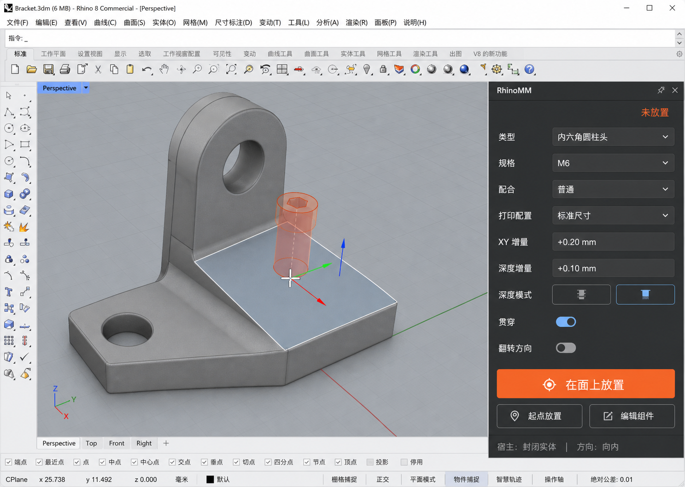
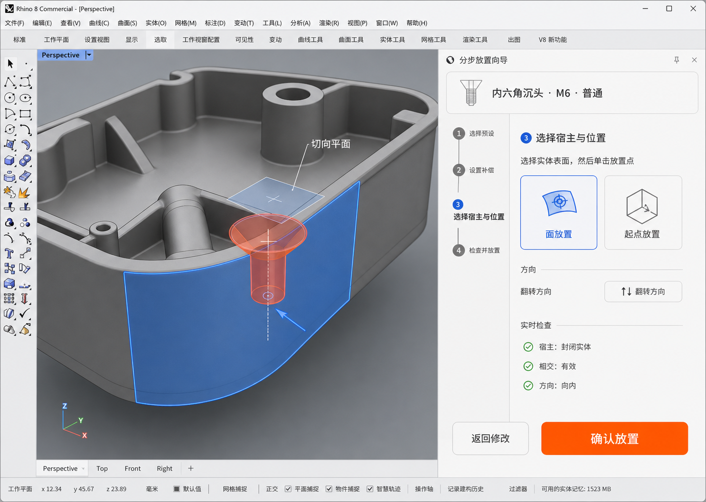
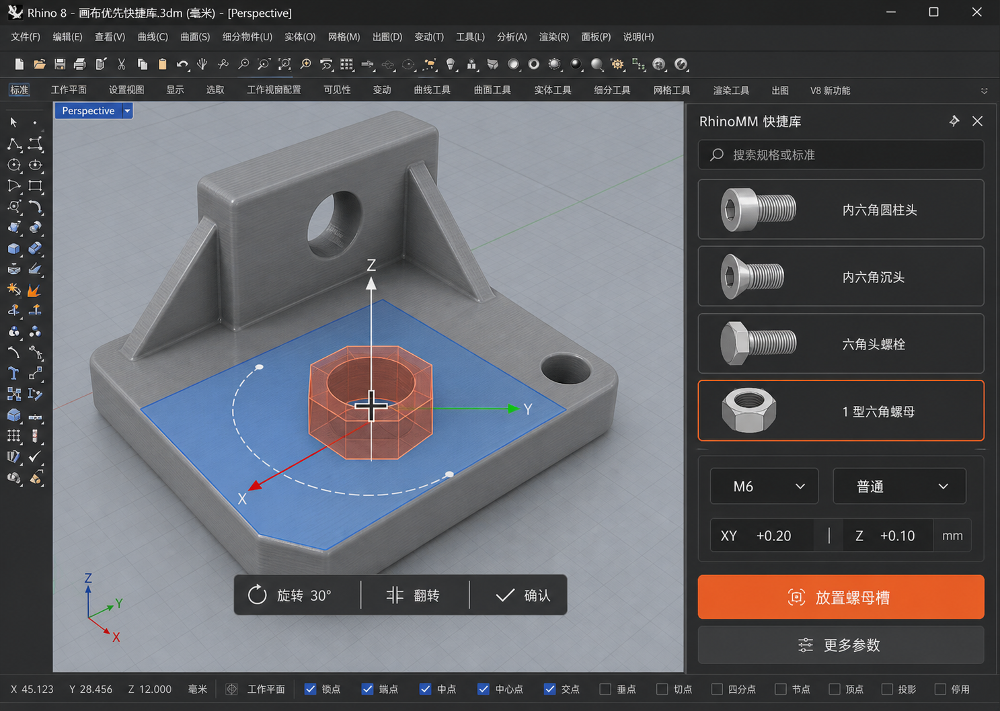

# 产品草图

三套草图探索同一个核心任务：选择标准紧固件、设置 FDM 补偿、在 Rhino 模型上预览并放置可编辑切割组件。

这些图用于确定信息结构和交互方向，不代表 Rhino 原生界面的最终像素级实现。图片中的紧固件图形是概念表达；实际产品使用一致的矢量图标和 Eto 原生控件。

## 方向一：参数检查器

适合熟悉 Rhino 的高频用户。全部关键参数在一个紧凑面板中可见，放置动作直接，切换成本最低。

- **优势**：效率高、状态透明、易于连续放置。

- **风险**：首次使用时字段较多，需要合理默认值和渐进式高级选项。

## 方向二：分步放置向导

把预设、补偿、宿主位置和确认拆成四步，并在最后显示实时检查结果。

- **优势**：学习成本低，适合复杂曲面和异常提示。

- **风险**：重复放置时步骤偏多，不适合作为唯一高频界面。

## 方向三：画布优先快捷库

用紧凑视觉库选择类型和规格，把旋转、翻转、确认放到孔位附近，最大化模型视口。

- **优势**：视觉识别快，视线移动少，适合连续放置。

- **风险**：上下文工具条需要精确处理遮挡、缩放和取消状态。

## 推荐组合

MVP 以“参数检查器”为主框架，因为它最符合 Rhino 专业用户的高频工作方式。吸收另外两套方案中的两个元素：

- 使用“分步放置向导”的实时检查清单，但不强制用户逐步翻页。
- 使用“画布优先快捷库”的旋转、翻转、确认上下文操作，但停靠面板仍提供完整参数。

后续评审应重点验证：面板宽度、高 DPI 中文文本、连续放置效率、曲面法向理解，以及上下文工具条是否遮挡小型零件。
